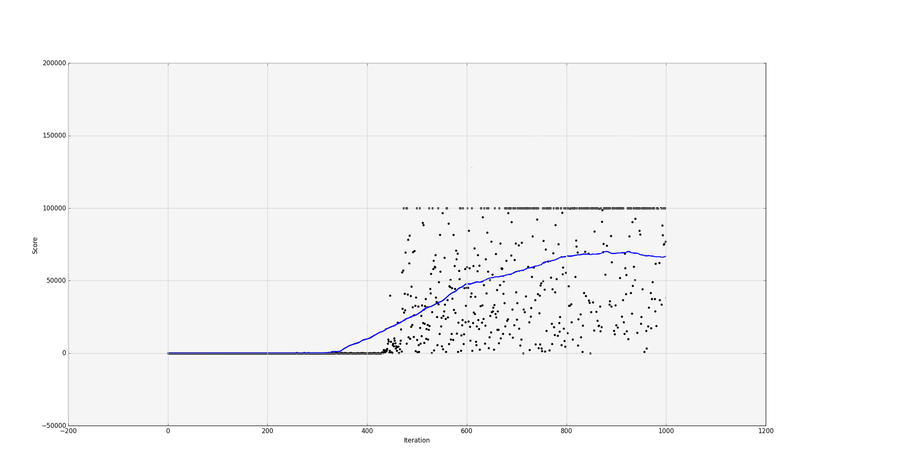

# Flappy: Q-learning

This project is made as an experiment with Q-learning in a relatively simple enviroment; in the world of Flappy Bird.

The dependencies of the project are `pygame`, `numpy` and optionally `matplotlib` for plotting the results of a learning period.

The goal was to implement the algorithm in practice and potentially improve on the works I discovered in github; previous experiments by [Cihan](https://github.com/chncyhn/flappybird-qlearning-bot) and [SarvagyaVaish](https://sarvagyavaish.github.io/FlappyBirdRL/).

## Q-learning

- Q-learning is a model-free reinforcement learning algorithm, using a Q-table to store quality values to each state-action pair. Q(s, a)
- The Q-value for a particular state-action pair is updated using the formula:
$$Q(s, a) = Q(s, a) + \alpha \left[ R(s, a) + \gamma \max_{a'} Q(s', a') - Q(s, a) \right ]$$ 
- $Q(s, a)$ is the current value
- $R(s,a)$ is the reward for taking action $a$ in state $s$
-  $max_{a'} Q(s', a')$ is the maximum predicted reward achievable in the new state $s'$, considering all possible actions $a'$.
- $\alpha$ is the learning rate, determining how much the new information overrides old information.
- $\gamma$ is the discount factor, determining the importance of future rewards compared to immediate rewards

### Integrating into the Flappy Bird enviroment

- The state-space consist of:
  - Vertical distance from lower pipe
  - Horizontal distance from next pair of pipes
  - Velocity of the bird
  
- The reward function I used to evaluate an action taken in a state is the following:
  - -1000,  if the bird dies
  - +15,  if the bird passes through a pipe
  
- Given the extensive range of possible values for each state variable, I have implemented a discretization.
- Each state is discretized into 10 bins.
- Given this discretization strategy, the state-space consist of only $10^3$ states.
  

  
  
  

  

## Results

- I've ran several training sessions, and found, that with a relatively low $\alpha$ (0.2), and high $\gamma$ (0.99), the agent is able to converge *very fast*, in about 400 episodes.
- Given, that the state-space is relatively small, I kept $\epsilon$ (the exploration factor) at 0, because I found, that even at really low values (1e-10), the agent performs significantly worse.
- Below is the result of 1000 training episodes, where after 400 episodes the agent averaged above 5000 points.

### How to run

